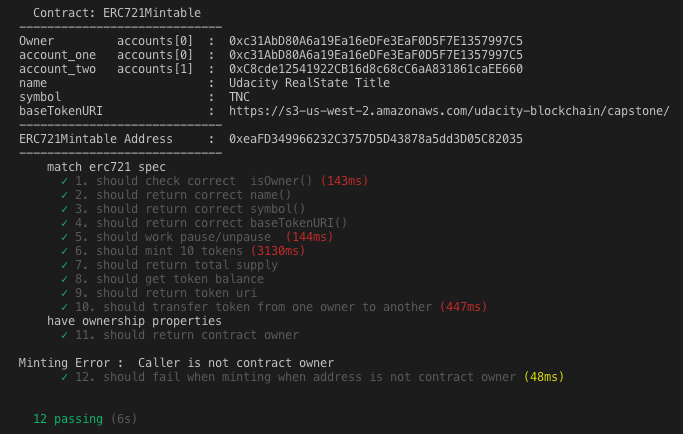
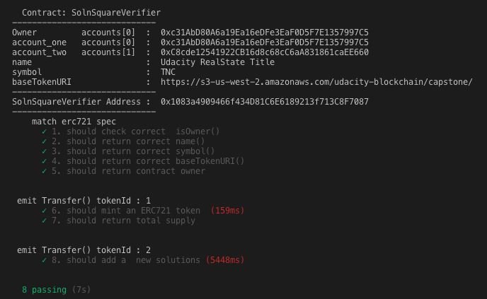
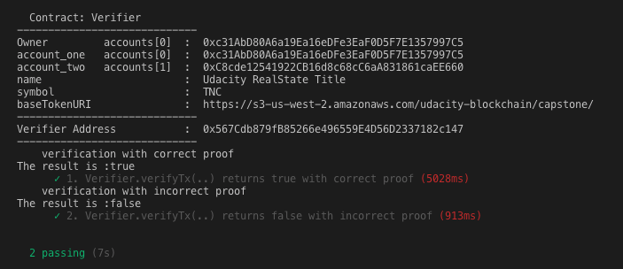
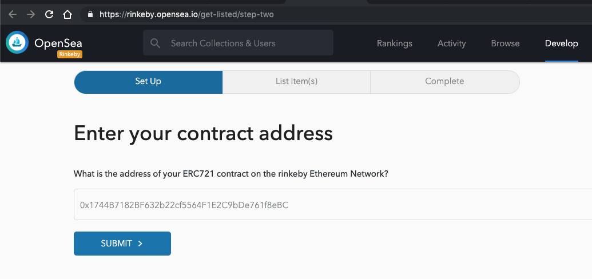
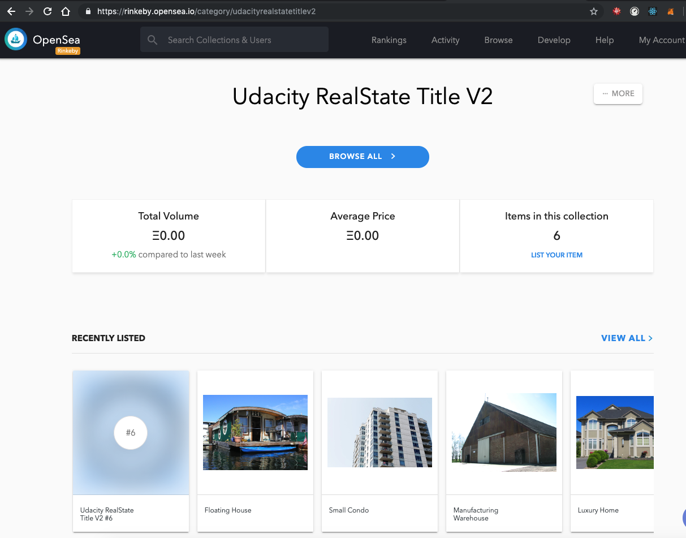

# Udacity Blockchain Capstone
This is a sample application for Udacity's Blockchain course.  A decentralized house listing service.

**Project name: udbcd-Blockchain-Capstone**

This project is connected to the _Blockchain Developer Nanodegree Program_ course by **Udacity**.
We are using OpenSea in this project to list the property tokens for sale. In order to list a property, you'll need to go to the item on your account page. On the item detail page, click "Sell". This will walk you through the steps for selling an item. Note that the first time you auction an item, you will need to complete several MetaMask transactions in order to give the exchange contracts access to your items. After you complete these initial steps, creating an auction will only require signing a MetaMask message. This means that you can auction items without paying gas.

## Getting Started

These instructions will get you a copy of the project up and running on your local machine for development and testing purposes.

## Environment ###
This program requires **node.js**  and **npm** program envirenment 

## Prerequisites
Please make sure you've already installed 
  Tools and  used version
*   node               (v10.15.0)
*   npm                 (6.4.1)
*   Ganache CLI v6.2.5 (ganache-core: 2.3.3)
*   Truffle v5.0.13 (core: 5.0.13)
*   Solidity - 0.5.2 (solc-js)
*   MetaMask extension for browser ( 6.1.0)
*   Web3.js v1.0.0-beta.37

## Installing
A step by step series of examples that tell you have to get a development env running.

#### Create a local working directory and then  clone github repository:
```
mkdir workspace
cd workspace
https://github.com/nacikaly17/udbcd-Blockchain-Capstone.git
```
#### Install required node packages 
Change to project folder and install all requisite npm packages (as listed in ```package.json```):

```
cd udbcd-Blockchain-Capstone
npm install
```

#### Open a  terminal window and Launch Ganache:
If you are using ganache-cli use this command to add 40 funded accounts:
```
ganache-cli -p 8545 -m "candy maple cake sugar pudding cream honey rich smooth crumble sweet treat" --gasLimit 300000000 --gasPrice 20000000000 -a 40

```

#### Open a separate terminal window and  compile smart contracts:
Change to the folder ```eth-contracts``` 
cd udbcd-Blockchain-Capstone
cd eth-contracts
```
truffle compile
```

This will create the smart contract artifacts in folder ```./build/contracts```.

#### Migrate smart contracts to the locally running blockchain, ganache-cli:
Change to the folder ```eth-contracts``` 
```
truffle migrate --reset
```
This will :
  - deploy the smart contract artifacts to running Ganache 
 
#### Test smart contracts:
Change to the folder ```eth-contracts``` 
```
truffle test ./test/TestERC721Mintable.js 
```



All 12 tests should pass.

```
truffle test ./test/TestSolnSquareVerifier.js  
```



All 8 tests should pass.

```
truffle test ./test/TestSquareVerifier.js  
```



All 2 tests should pass.


#### Deploying contracts to rinkeby
###### Following contracts are deployed to rinkeby for this project:
* Deploying 'ERC721Mintable'
```
    contract address:    0xAB24bBaD8829aC75F48ad44ECce36C1b40e6a58F
```
* Deploying 'Verifier'
```
    contract address:    0xA4DeD8b048D6507e90e196A7bA05f9d42125BBB5
```
* Deploying 'SolnSquareVerifier'
```
    contract address:    0x1744B7182BF632b22cf5564F1E2C9bDe761f8eBC
```

You can even check out the source code for this smart contract by rinkeby etherscan:
  [SolnSquareVerifier](https://rinkeby.etherscan.io/address/0x1744B7182BF632b22cf5564F1E2C9bDe761f8eBC).
  
###### To deploy your contracts with truffle:
You should set Infura API key and metamask mnemonic as environment variables when running the truffle ( s. truffle-config.js) .
Change to the folder ```eth-contracts``` 
*  get an Infura API key
*  get metamask mnemonic
*  Open a  terminal window and run following commands
```
export INFURA_KEY="<your_infura_key>"
export MNEMONIC="<metamask>"
export NETWORK="rinkeby"
truffle migrate --network rinkeby --reset
```

#### Mint tokens
###### For this project :
```
 10 tokens are minted

1. Minted token. Transaction: 0x7ce057661ab7cc4f972018ff00d52e0ca07c5224ac85202c1891e3afd5fad70f
2. Minted token. Transaction: 0xe05cd872e113820d299e9ef329f47726edc2af8f4dd10b78f634e3f7890eb4c0
3. Minted token. Transaction: 0x0d07d5a1f2191260787c4d1a9b7c7d06299c309da0db3bd6fec67589a77ff9b2
4. Minted token. Transaction: 0x2b95d7ead1427f34a01c2a566ea1594a77bfd8c64cd2bbd6d31acc26506261b1
5. Minted token. Transaction: 0x94e3053b5a5da53fae5821b8a4588df5d8b1bfc2ef48ccac7468040dcbbfe34b

```
We'll mint these assets into an account that we control so that we can test the OpenSea auction flow for our items.
After deploying to the Rinkeby network, there will be a contract on Rinkeby that will be viewable on Rinkeby Etherscan. 
You can find the address of the deployed contract in the output of the deployment command and find it on Etherscan by hitting the URL:  
https://rinkeby.etherscan.io/address/<contract_address>.

###### To mint your contracts with truffle:
You should set this contract address and the address of your MetaMask account as environment variables when running the minting script:
Open a separate terminal windowChange to project folder:
```
cd udbcd-Blockchain-Capstone
export OWNER_ADDRESS="<my_address>"
export NFT_CONTRACT_ADDRESS="<deployed_contract_address>"
node scripts/mint.js
```

#### Submit Contract to the OpenSea Marketplace:
OpenSea has a Rinkeby environment that allows developers to test their integration with OpenSea. 
This can be found at rinkeby.opensea.io. 

    https://rinkeby.opensea.io/get-listed/step-two

By using <contract_address> (SolnSquareVerifier), we should be able to use our contract  on OpenSea. 

Your terminal should look something like this:


#### Launch the OpenSea:

Your terminal should look something like this:



## Built With

* [Ethereum](https://www.ethereum.org/) - Ethereum is a decentralized platform that runs smart contracts
* [Truffle Framework](http://truffleframework.com/) - Truffle is the most popular development framework for Ethereum with a mission to make your life a whole lot easier.
* [ZoKrates](https://github.com/Zokrates/ZoKrates) - Implement zkSnarks using ZoKrates, a toolbox for zkSNARKs on Ethereum.
* [Docker](https://docs.docker.com/install/) - Docker is the recommended way to get started with Zokrates. Docker is a tool designed to make it easier to create, deploy, and run applications by using containers.
* [OpenSea](https://docs.opensea.io/docs) - OpenSea is a decentralized marketplace that is used for selling for crypto assets
* [Infura](https://infura.io/) - Scalable Blockchain Infrastructure
* [Metamask](https://metamask.io/) - MetaMask is a bridge that allows to visit the distributed web in browser.

## Acknowledgments
* Solidity
* Ganache-cli
* Truffle
* JavaScript
* Node
* Ethereum
* Blockchain

# Project Resources
* [How does Ethereum work anyway?](https://medium.com/@preethikasireddy/how-does-ethereum-work-anyway-22d1df506369)
* [Remix - Solidity IDE](https://remix.ethereum.org/)
* [Visual Studio Code](https://code.visualstudio.com/)
* [Truffle Framework](https://truffleframework.com/)
* [Ganache - One Click Blockchain](https://truffleframework.com/ganache)
* [Open Zeppelin ](https://openzeppelin.org/)
* [Interactive zero knowledge 3-colorability demonstration](http://web.mit.edu/~ezyang/Public/graph/svg.html)
* [Docker](https://docs.docker.com/install/)
* [ZoKrates](https://github.com/Zokrates/ZoKrates)
* [OpenSea](https://docs.opensea.io/docs)
* [Infura](https://infura.io/)
* [Metamask](https://metamask.io/)